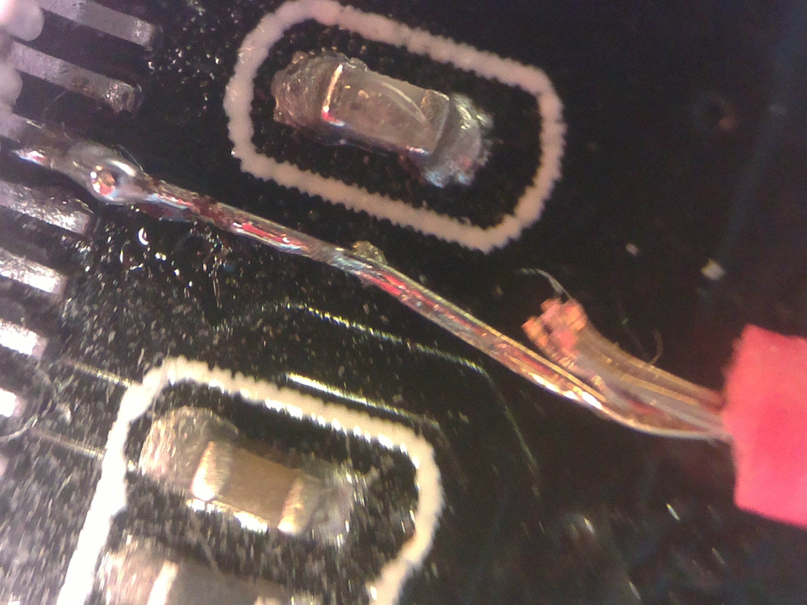

## ESP32-CAM ov2640 sensor global external shutter

* [Introduction](#introduction)
* [Setup for global external shutter](#setup-for-global-external-shutter)
* [Tools](#tools)
* [Requirements](#requirements)
* [Capturing](#capturing)
* [Single exposure](#single-exposure)
* [Multiple exposure](#multiple-exposure)
  * [shots tool](#shots-tool)

## Introduction

This is a sub project of [Raspberry v1 camera global external shutter](../README.md). ESP32-CAM ov2640 image sensor is a predecessor of v1 camera ov5647 sensor. From the 38 pins inside ov2640 image sensor unfortunately pins B2 (FREX) and A2 are connected. Because of that global external shutter with ov2640 sensor has some limitations compared to v1 camera. See section [Requirements](#requirements) for needed soldering for ESP32-CAM module.

In order to use FCameraWebServer as 2nd Arduino IDE ESP32->Camera example only one symbolic link needs to be created:

    cd ~/.arduino15/packages/esp32/hardware/esp32/1.0.2/libraries/ESP32/examples/Camera
    ln -s ~/Raspberry_v1_camera_global_external_shutter/FCameraWebServer

This allows to use github sub project FCameraWebServer in Arduino IDE as if it was installed with arduino-esp32 examples.

## Setup for global external shutter

tbd

## Tools

* [FCameraWebServer](FCameraWebServer) (ESP32 Arduino sketch providing new feature)

* [get_index_html](index/get_index_html) (extracts index.html into index directory for modifications)
* [put_index_html](index/put_index_html) (creates new camera_index.h from modified index directory index.html)

Executing get_index_html tool in index folder, and then put_index_html tool should be an identity transform on camera_index.h (because index.html was not changed). Unfortunately the gunzip followed by gzip does change few bytes in first line:

    ...
     const uint8_t index_ov2640_html_gz[] = {
    - 0x1F, 0x8B, 0x08, 0x08, 0x99, 0x83, 0x16, 0x5D, 0x00, 0x03, 0x69, 0x6E, 0x64, 
    + 0x1F, 0x8B, 0x08, 0x08, 0x91, 0x84, 0x16, 0x5D, 0x00, 0x03, 0x69, 0x6E, 0x64, 
      0x68, 0x74, 0x6D, 0x6C, 0x00, 0xE5, 0x5D, 0xEB, 0x92, 0xD3, 0xC6, 0x12, 0xFE, 
    ...

If such change is not wanted, "git checkout -- camera_index.h" does "undo" that.

## Requirements

For the global external shutter features, a cable has to be soldered carefully to pin10 of the ov2640 flat ribbon cable connector on ESP32-CAM module (the pins are 0.5mm spaced, I used a [Raspberry v1 camera preview on HDMI monitor as magnifying glass](https://www.esp32.com/viewtopic.php?f=19&t=11126&p=45445#p45445) for soldering, and superglued the cable plastic to ESP32-CAM module for stress relief):

 
 
No requirements for "Flash" toggle. This new feature is unrelated to global external shutter work:  

It allows to capture with ESP32-CAM flash off or on:  

## Capturing

tbd

## Single exposure

tbd

## Multiple exposure

#### shots tool

tbd
