## Raspberry v1 camera global external shutter

Associated [Raspberry forum thread](https://www.raspberrypi.org/forums/viewtopic.php?f=43&t=241418).

This is the parent project of [ESP32-CAM ov2640 sensor global (external) shutter](../../tree/master/FCameraWebServer).

* [Introduction](#introduction)
* [Setup for global external shutter](#setup-for-global-external-shutter)
* [Tools](#tools)
* [Requirements](#requirements)
* [Capturing](#capturing)
* [Single exposure](#single-exposure)
* [Multiple exposure](#multiple-exposure)
  * [shots tool](#shots-tool)
  * [PWM exposure](#pwm-exposure)
  * [Sound trigger](#sound-trigger)
  * [kFPS videos from kEPS multiple exposure frames](#kFPS-videos-from-kEPS-multiple-exposure-frames)
* [Hardware camera sync pulses](#hardware-camera-sync-pulses)

## Introduction

Raspberry v1 camera (or clone, v1 camera was sold last 2016 by Raspberry Pi Foundation) does not provide a global shutter mode. But it does provide a "global reset" feature/[FREX mode](https://cdn.sparkfun.com/datasheets/Dev/RaspberryPi/ov5647_full.pdf#page=43) (whole frame pixels start integration at the same time, rather than integrating row by row). 

This repo describes how to build an external shutter for v1 camera and provides tools allowing for taking Raspberry v1 camera global external shutter videos.

So why do you may want global shutter videos?

Mostly for fast moving scenes. The propeller of mini drone rotates with 26000rpm and has a blade diameter of 34mm. The radial speed at blade tips is quite high, 0.034m×pi×(26000/60)=46.3m/s(!) or 166.6km/h.

This is a frame you get with v1 camera normal [rolling shutter](https://en.wikipedia.org/wiki/Rolling_shutter) mode, total distortion:  
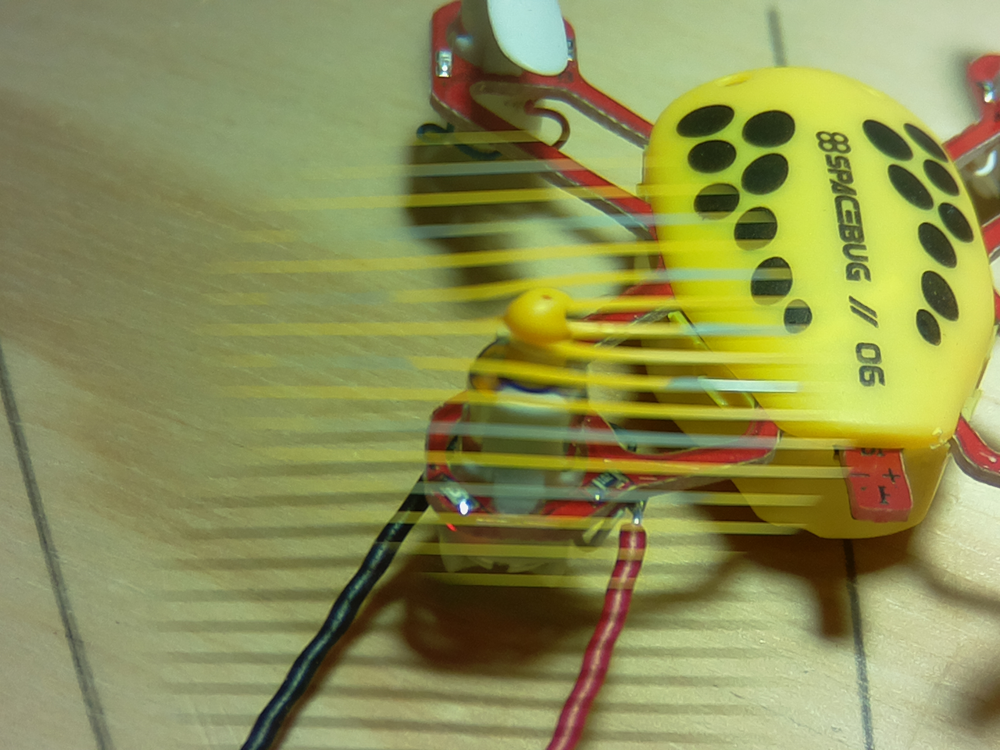

This is animation of video taken with global external shutter technique (scene lit by 5000lm led with 36µs strobe pulse duration; 1 second from 25fps video, converted into an animated .gif playing at 5fps, allowing to really see each single global shutter frame, as well as to see that the other propellers+motors are heavily shaken by the front propeller wind):   
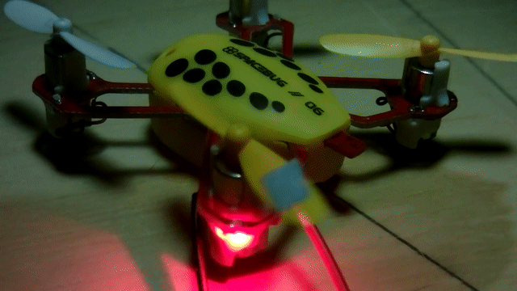

How do you get that? By powering off light quickly after the end of the strobe pulse, and a really dark scene. Only that way further accumulation of light can be avoided for the lower lines of the frame that are sent to Pi from camera later than the very first lines.

These methods for total darkness work:
- close room door and window shutter completely
- cover complete setup (2nd "shots tool" section example) with moving box
- cover only camera, bright light and eg. propeller with moving box 

There are commercially available highspeed flashes like the [Vela One](http://www.vela.io/vela-one-high-speed-flash). Compared to the 5000lm diy highspeed flash described in next section (that has proven to be able to capture with 4µs flash duration), the Vela One has advantages and disadvantages:
- (+) allows for flash durations down to 0.5µs (diy will not provide enough light for that duration)
- (+) provides 1 million lumens compared to 5000lm
- (-) costly (940£) compared to 20$ for diy
- (-) low maximal continuous strobe frequency (50Hz) compared to 9KHz of diy shown already (90KHz possible)

The first point can be mitigated a bit for diy highspeed flash. What really counts is lux, not lumens. For given lumen, lux is inversely quadratric proportional to distance (reducing distance by factor x increases lux by factor x²). The airsoft pellet trajectories just above [5000lm led (without COB reflector) shown below](#user-content-9000eps) provided an immense increase of lux hitting the flying pellet.

## Setup for global external shutter

This is the setup:
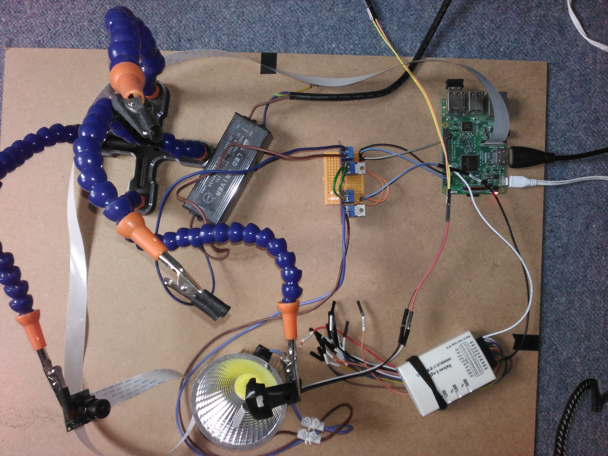

You need (aliexpress.com free shipping prices):
* very bright 50W 5000lm led (2$)
* 40x40x20mm aluminum heatsink (2$)
* 50W led driver (7$)
* plastic COB reflector (3$)
* IRF520 mosfets (2×1$)
* v1 camera (clone 6$)
* spare drone motor+propeller (4$)

The 0-24V IRF520 mosfets are used in series to control 38V/1.5A from 50W led driver to 5000lm led. Pi GPIO13 is connected with both mosfet SIG pins. Power the propeller from an independent power source, I use a constant voltage power supply because that allows to easily change propeller voltage and by that propeller rpm.

In above photo reflector sits on 5000lm led sits on top of aluminum heatsink. Here is another option for light direction vertically down, aluminum heatsink on top of 5000lm led on top of reflector on top of plexiglas above scene:  
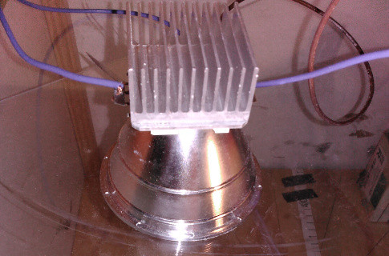

The smaller the distance from led to object, the more lumens from same 5000lm led. In case you can place the object you want to light directly above the led, it is better to not use the reflector at all. The Raspberry v1 camera captures from below led level slightly upwards. This increases brightness of captured frames over using the reflector:  
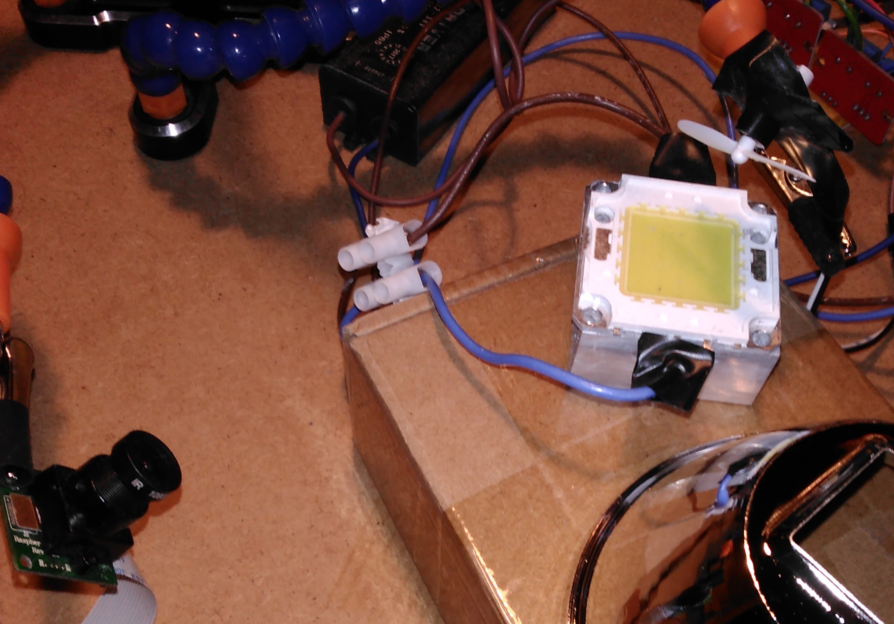

See [airshot pistol shot just above 5000lm led without reflector](#user-content-bottom_led) for another example.

The captures done for airsoft pistol showed captured pellets with dark top because of led light from bottom only. Adding a 2nd 50W led driver and 2nd 5000 lm led (both connected in parallel) lighting from top resolved this issue, see for [airgun shot](#user-content-bottom_plus_top_led) captured with that setup:  
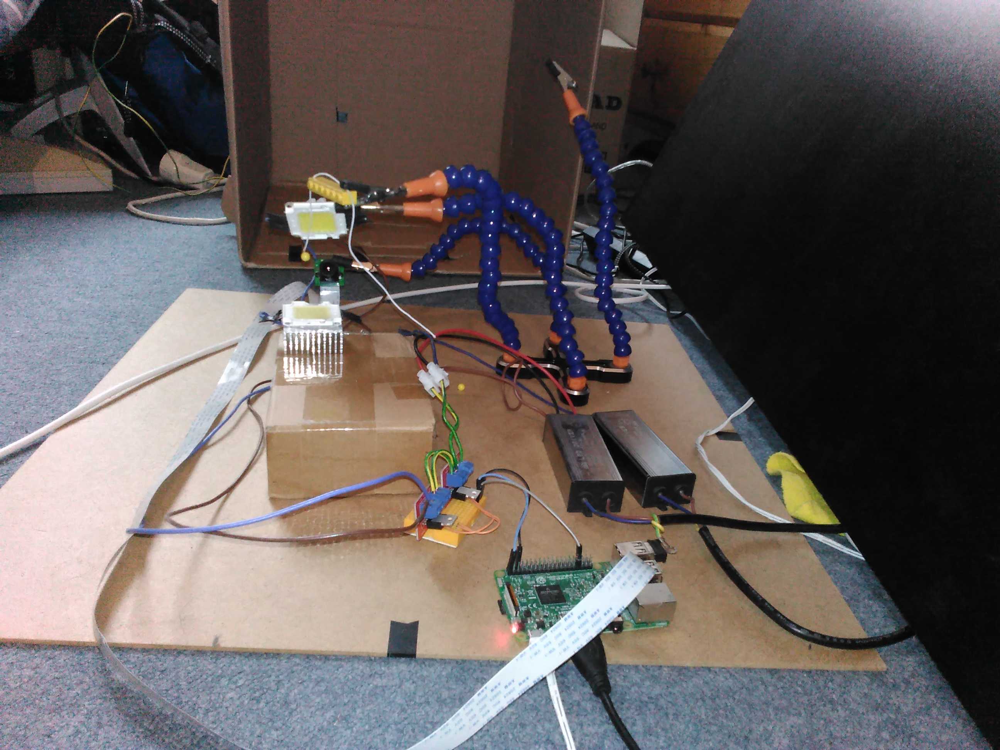

This is complete setup with airgun clamped to desk. Some cables are now passed below living room desk in order to not show up in camera view. See [9000eps](#user-content-9000eps) airgun pellet capture done with this setup:
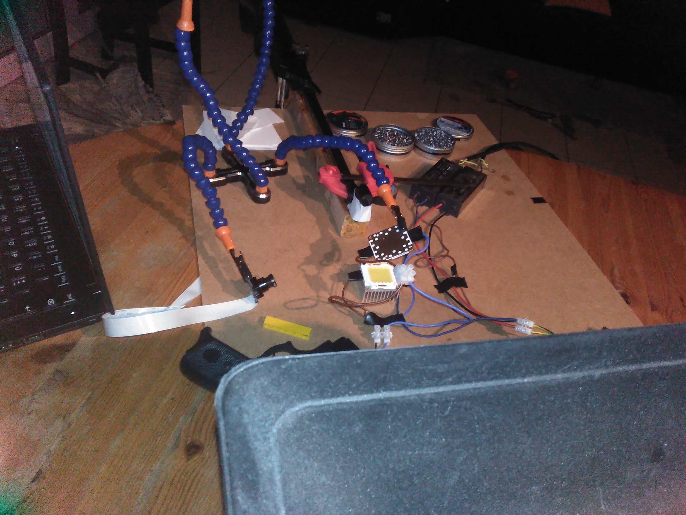

Most of the captures described on this repo were done without a black background. The dark background was achieved with long range of free space behind scene. That works fine because light intensity drops quadratic with distance. For [Sound trigger](#sound-trigger) work I wanted to have setup small and on my desk in reach. I created a black cardboard that I used as dark background, as can be seen on the left. This is not necessary in general if you have long free space after the scene. But if using black cardboard as background with 5000lm led flash, then it needs to be really black. I used "the blackest black" [Black 3.0](https://culturehustle.com/products/black-3-0-the-worlds-blackest-black-acrylic-paint-150ml) from kickstarter campain for that, it absorbs 98% of incoming light. In this setup I did make the 5000lm led with heatsink stand vertically, unlike lighting from bottom or top before. This allowed to use only a single of my two 5000lm leds (this type of lighting is more like the flashes of cameras, from direction of lens):
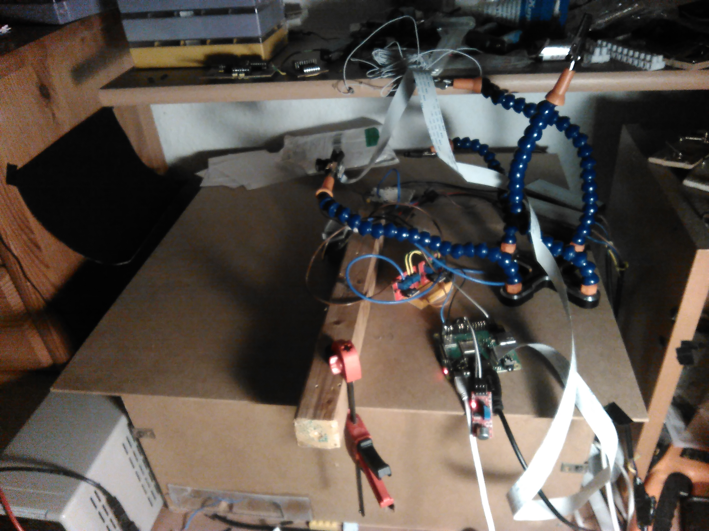

## Tools

* [raspivid_ges](tools/raspivid_ges) (if starting with default parameters, captures 2MP tst.h264 video at 1fps global external shutter mode)
* [raspividyuv_ges](tools/raspividyuv_ges) (global external shutter for raspividyuv)
*
* [shot](tools/shot) (single exposure)
*
* [shots](tools/shots) (multiple exposure)
* [5shots](tools/5shots) (sample for different strobe pulse length multiple exposure)  
* [pwm_ges](tools/pwm_ges) (pwm exposure)
* [doit90](tools/doit90) (script for [capturing pellets](#user-content-9000eps))
* [audio_shots.c](tools/audio_shots.c) (used in [Sound trigger](#sound-trigger) section)
*
* [gpio_alert.c](tools/gpio_alert.c) (camera synced multiple exposure sample)
*
* [toFrames](tools/toFrames) (converts .h264 video (tst.h264 by default) to multiple frames (frame0000.jpg, frame0001.jpg, ...))

## Requirements

pigpio library can be found here: [http://abyz.me.uk/rpi/pigpio/download.html](http://abyz.me.uk/rpi/pigpio/download.html).

Hardware PWM is available on GPIO(12|18) and GPIO(13|19) only (pigpio [software PWM frequencies](http://abyz.me.uk/rpi/pigpio/pigs.html#PFS) are too restricted). 

|               |HW PWM|any GPIO| |pigpio|ffmpeg| |I2C|camera|
|--------------:|:----:|:------:|-|:----:|:----:|-|:-:|:----:|
|   raspivid_ges|      |   ×    | |   ×  |      | | × |   ×  |
|raspividyuv_ges|      |   ×    | |   ×  |      | | × |   ×  |
|           shot|      |   ×    | |   ×  |      | |   |      |
|          shots|      |   ×    | |   ×  |      | |   |      |
|         5shots|      |   ×    | |   ×  |      | |   |      |
|        pwm_ges|  ×   |        | |   ×  |      | |   |      |
|     gpio_alert|      |   ×    | |   ×  |      | |   |      |
|       toFrames|      |        | |      |   ×  | |   |      |

## Capturing

Just calling "raspivid_ges" starts raspivid with default parameters (mode 1 capture at 1fps, 960x540 preview window, flash AWB, output to tst.h264, in background, endless runtime), triggers 2s continuous strobe just before starting raspivid for getting correct settings by AWB, injects I2C commands to bring v1 camera into global external shutter mode and waits for raspivid to end. With default parameter endless runtime you can simply end raspivid_ges by pressing CTRL-C. In case you provide different set of parameters and do some "-t ..." setting, raspivid_ges ends after raspivid completed.

If you want one terminal only (text mode/X11 or ssh session), you can start raspivid_ges in background as well, otherwise you can execute the tools shot/shots/5shots/pwm_ges from a second terminal. You can repeat executing those tools while raspivid_ges is running. In case HDMI monitor is connected, you can directly see the effects on calling such a tool (with a <1s delay) on HDMI monitor preview. One property of global external shutter technique is, that you can look at the rotating propeller directly without HDMI monitor, and see the same global shutter effects directly with just your eyes.

So a session for capturing a single "shot" tool frame example is this:

	$ ssh pi@yourpi
	...
	$ raspivid_ges &
	$ PID=$!
	$ shot
	$ kill -9 $PID
	$ toFrames 
	$ logout
	$ rm -f frame????.jpg; scp pi@yourpi:frame????.jpg .; eog frame????.jpg

You will step through the extracted 2MP frames from captured tst.h264 with eog tool to find the one frame with the captured flash.

## Single exposure

Single exposure global shutter capturing is when at most one strobe flash happens per frame. Tool [shot](tools/shot) allows you to send a single flash pulse (by default 9µs pulse duration to GPIO13, you can pass different arguments):

	$ shot 9 13
	$

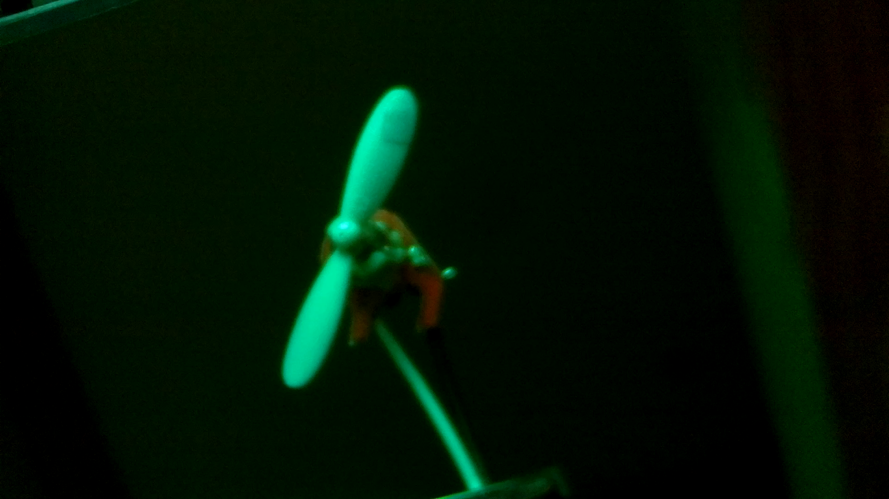

## Multiple exposure

In this scenario more than one strobe flash happens per frame captured. Since by that exposures can be far more frequent than any high framerate video capturing can do (maximally 750fps/1007fps for v1/v2 camera, due to needed slow frame transfer to Pi), this will be called "x eps frame" (exposures per second).  

#### shots tool

Tool [shots](tools/shots) allows to send multiple strobe pulses (by default five 9µs pulses 241µs apart on GPIO13):

	$ shots
	$

This is a "4000 eps frame" (1000000/(9+241)):
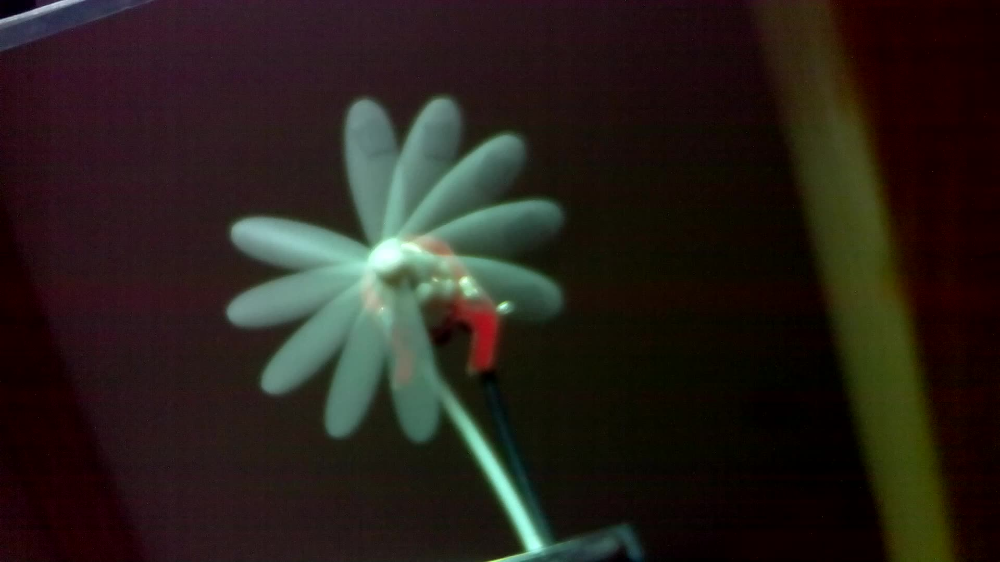

Same scene with different lighting, in case you have no room where you can close all doors and all window shutters. Just put a moving box above the complete setup:
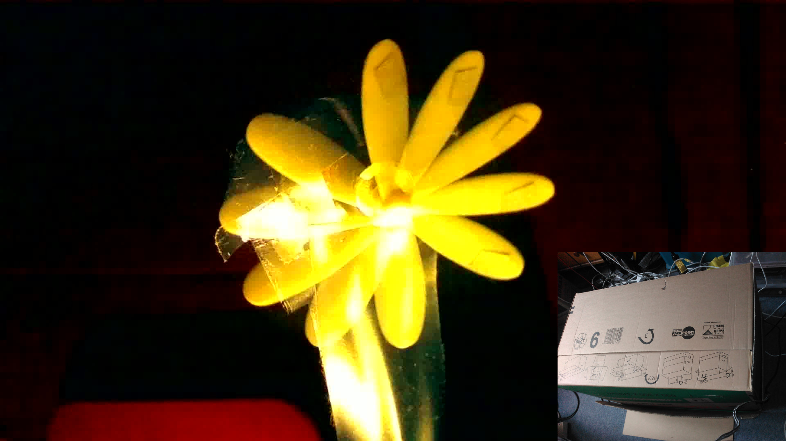

Different parameters example:

	$ shots 9 9 116
	$

This is a "8000 eps frame" (1000000/(9+116)):
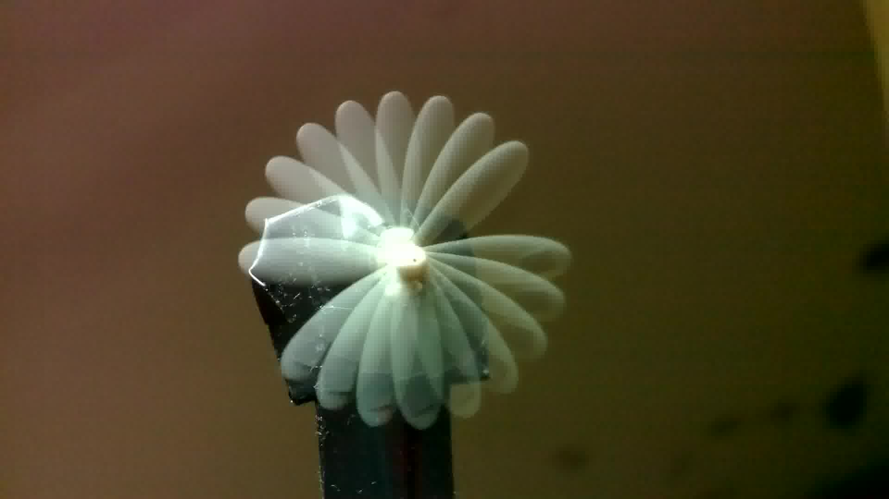

Tool [5shots](tools/5shots) does 5 exposures with different strobe pulse widths (1/3/5/7/9µs pulse widths):

	$ 5shots
	$

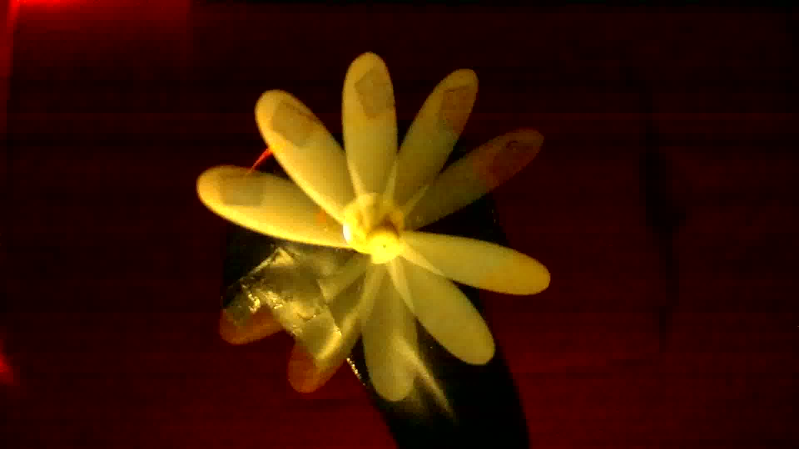

Same scene with slightly different lighting (you can see 5 blades with reflective tape at bottom):
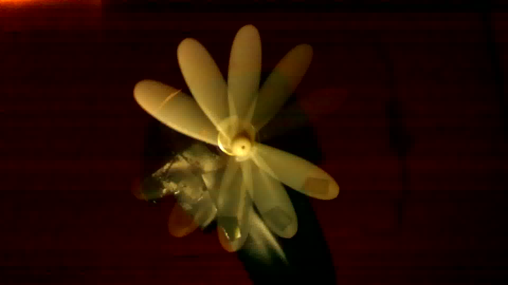

"shots 2 9 900000" captures two 9µs strobe pulse widths, 0.9s apart. With raspivid_ges tool's "-fps 1" default setting most times the first flash happens on one tst.h264 frame captured, and the 2nd flash happens on the next frame. But after 15 attempts I was successful and captured both flashes on same frame, proving that it is possible. See section [Hardware camera sync pulses](#hardware-camera-sync-pulses) on how to get both flashes captured on a single frame guaranteed: 
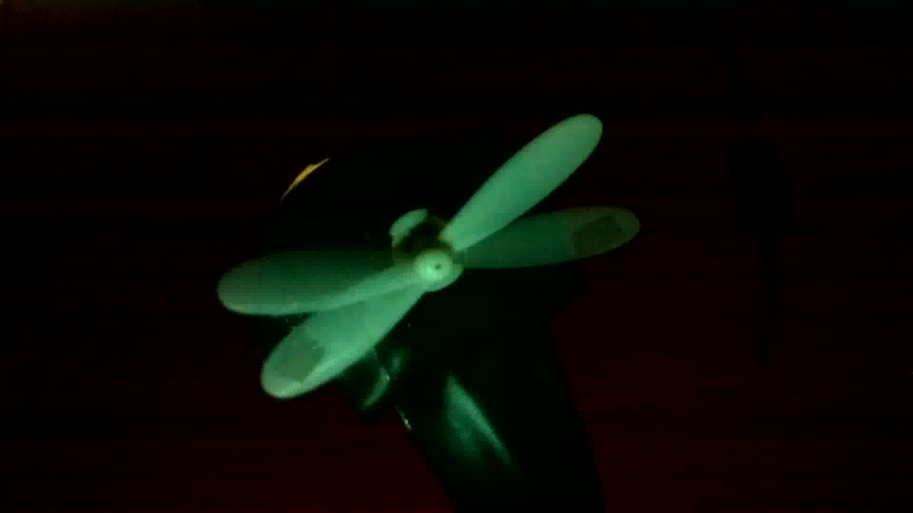

#### PWM exposure

Above captures were all radial, this one is linear. The frame captured 6mm diameter airsoft pistol pellet in flight. A fixed length pigpio waveform (as in shots) would need synchronization between triggering shot and triggering waveform (accoustic, laser light barrier or 665/1007fps high framerate video detection).  The simpler approach taken here is to use 3kHz PWM signal on GPIO13 with duty cycle 2.5% (8.33µs). Each 1fps frame gets 3000 flashes. This cannot be done inside moving box because all you would get is a white frame. Tool pwm_ges called without arguments uses exactly those settings as defaults. The command generates 6000 strobe pulses in order to not confuse raspivid AWB:

	$ pwm_ges
	$

This is a "3000 eps frame":
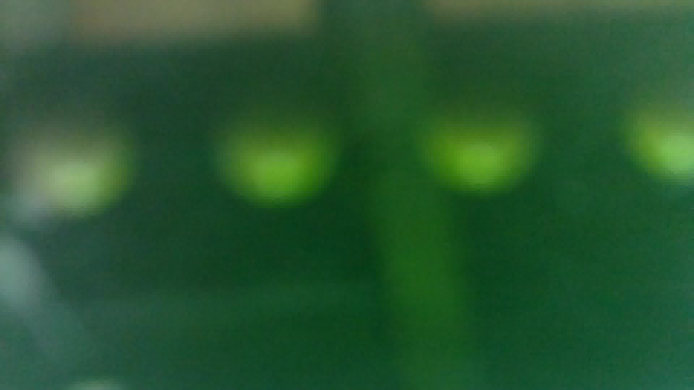

The frame is not perfect, just the first capture of flying pellet, not sharp because lens was not adjusted well, but it is proof that capturing (rifle) pellets in flight is possible with v1 camera!

The frame allowed to determine pellet speed while flying through camera view! The pellet diameter is 6mm, and I used gimp to measure diameter of pellet as 357 pixel. The distance from left side of 2nd to left side of 3rd pellet in frame was 563 pixels. Pellet speed therefore is (563px / 357px) × 6mm × 3000Hz = 28.38m/s.

Just for completeness, this is the 0.5 Joule 13$ airsoft pistol used, and a 6mm diameter 0.12g pellet:  
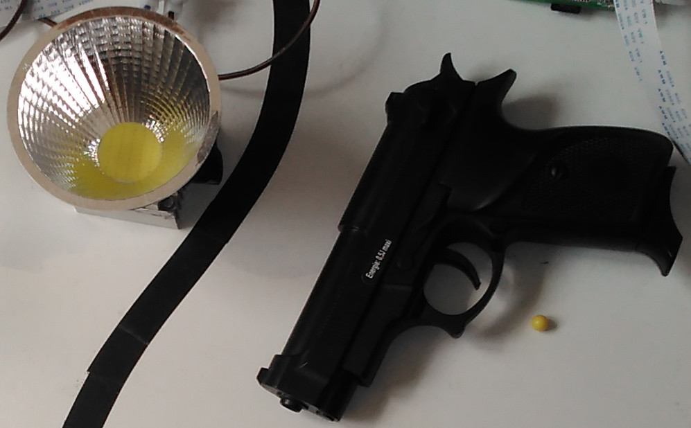

With lens sharp, background dark (doing raspivid_ges with framerate 30fps instead of 1fps results in only 100 strobe pulses lighting background for 3kHz PWM),

	$ raspivid_ges -md 1 -p 10,10,960,540 -fps 30 -awb flash -o tst.h264 -pts tst.pts -t 0

and without reflector (for shooting just above the 5000lm led at bottom, in order to increase lumens) muzzle speed is roughly

	(236px / 117px) × 6mm × 3000Hz = 36.3m/s

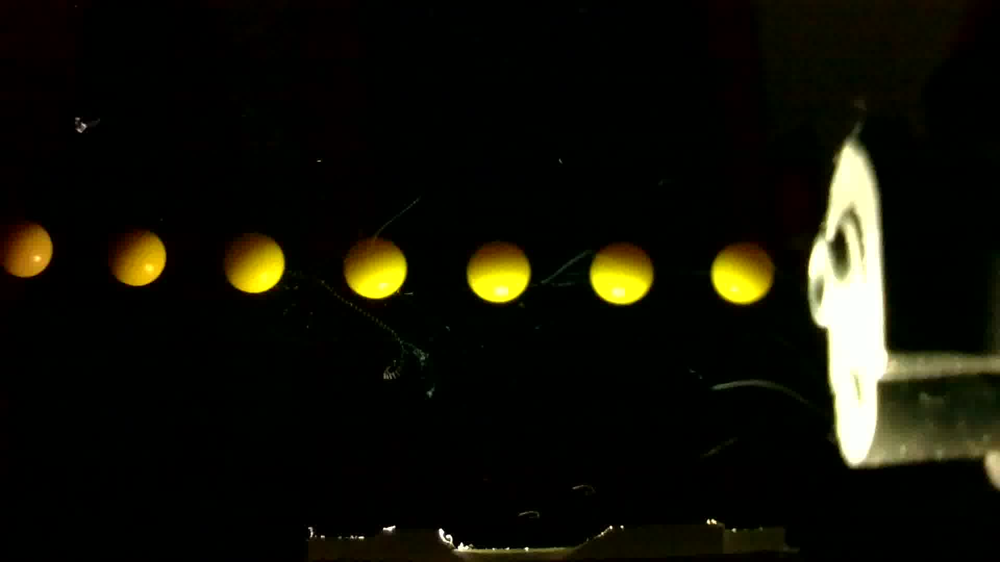

This is first shot of airgun from friend captured with raspiraw_ges:  
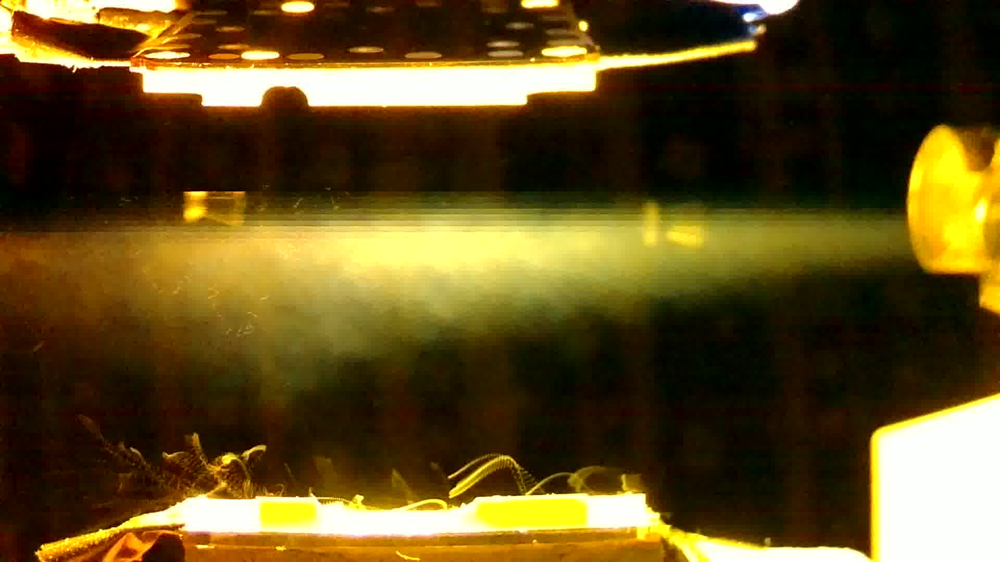

Taken with pwm_ges tool default parameters (8.33µs strobe pulses with 3kHz PWM) and raspivid_ges at framerate 30fps as before. 5mm pellet length is 121px, and distance between heads of both pellets captured is 881px. So muzzle speed is roughly

	(881px / 121px) × 5mm × 3000Hz = 109.2m/s (393km/h)

The recoil of 1-handed shot was surprisingly small (animated .gif created from frames scaled down 3×, 30fps captured frames played at 1fps):  
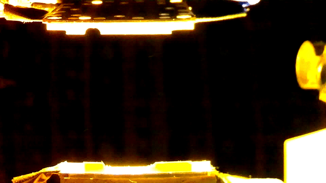

Increasing PWM frequency from 3kHz to 9kHz will get a brighter background with unchanged settings. Since 30fps is maximal framerate for 1920x1080 frames, this frame got captured at 90fps at the price of resolution (now 640x480). Pointed pellet was shot through paper clamped at airgun muzzle, reduced speed of pellet is 96.9m/s, with 96.9m/s / 9000Hz = 1.077cm between exposures:  
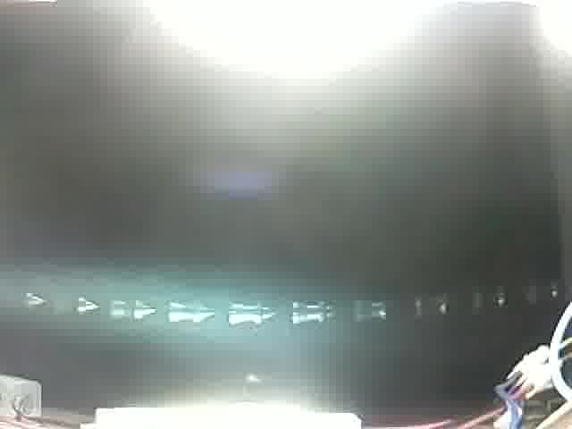

Small script [doit90](tools/doit90) was useful in automating what needs to be done for starting capture, get 2s AWB (in pwm_ges), and then start 2s PWM exposure until finally gracefully stop everything. In dark room starting the script allowed to move hand to (clamped on desk airgun) trigger during first 2s bright AWB phase, and then trigger shot during 2s PWM exposure phase.

The previous frame impressively shows that lens distortion plays a role. I used modified [OpenCV callibrate.py](https://github.com/opencv/opencv/blob/master/samples/python/calibrate.py) with 10 chessboard samples taken with the camera. The undistorted frame shows all pellet exposures on straight line:  
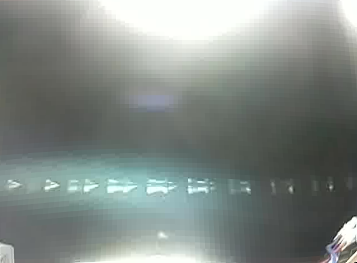

On the left you can see 8mm long pointed pellet used from a smartphone photo. On the right is in-flight pellet copied out from a frame captured with color problems, but with 1:1 pixel size. It was captured with same FoV as the frame before (but 2MP frame). With camera closer to pellet trajectory and adjusted camera lens much more details could be captured:  
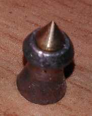 

Todos:
Next step is to use ~air gun for higher muzzle speed, and finally~ a real rifle. A 375m/s pellet does move 0.375mm/µs. If a frame every 3cm is wanted, exposures have to be taken every 30/0.375=80µs. The result will be a 12500 eps(!) frame (1000000/80).  
After that, maybe capturing [.50 bmg](https://en.wikipedia.org/wiki/.50_BMG) with 900m/s(!) might be a challenge. A former colleague of me did shoot .50 bmg ...

#### Sound trigger

There is one disadvantage of PWM exposures:  
A frame gets flash hits very often although the number of captured pellet exposures in a frame is much lower (eg. 100 flash hits for 9000eps pellet capture with 90fps video above, with only 10 pellet exposures in frame). Therefore background for PWM exposure is typically much brighter than needed.

This section describes sound triggered multiple exposure capturing. I used cheap 5V microphone sensor with digital and analog output as sound trigger. I connected GND/VCC/D0/A0 of microphone sensor to GND/3V3/GPIO17/- on the Pi. Although product description does not mention that this sensor works with 3.3V, it does:  

Tool [audio_shots.c](res/autio_shots.c) can be used for sound triggered multiple exposure. This command waits to be triggered from digital microphone sensor output, then waits for 2010µs offset, and then does 5 (9µs duration) flashes at frequency 6KHz:

    $ sudo killall pigpiod
    $ sudo ./audio_shots 5 9 6000 2010

One frame captured by a 36m/s airsoft pistol shot after the command started is this. Main difference to 6KHz PWM exposure is that pellet exposures on left and right side of frame are missing. Main advantage is that background is darker than with PWM exposure capturing:  
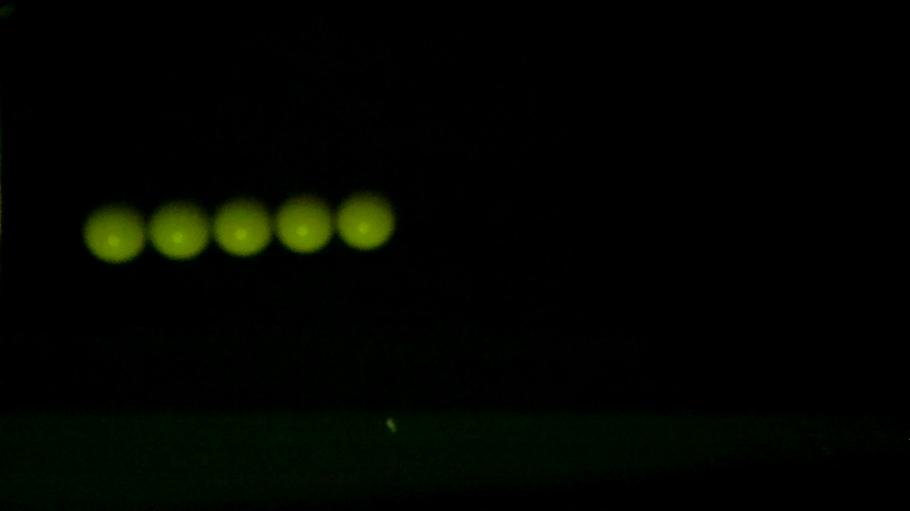

With 1st argument of audio_shots being "1", single shot capturing is possible. Frames like this can be captured (from [
Ultra high-speed imaging, capturing matrix style bullet time.](https://www.raspberrypi.org/forums/viewtopic.php?t=240442)):  
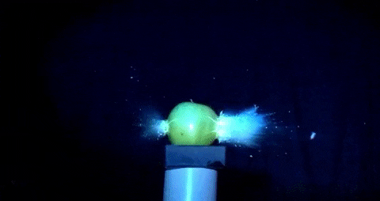

One investigation done with audio_shots tool already was whether pellet flying with 36m/s speed spins during flight (it spins fast!). I added small blue dot with permanent marker to north and south pole of some pellets. One pole is visible at least, that allowed to "see" whether there is spin or not. This is a capture of a marked pellet, and in fact it rotates. From one exposure to next at 6KHz time increased by 166µs. Looking at the 9 full in view pellet exposures, time passed from left to right is 8*166µs. Lets say the dot does roughly 1/8 of a full rotation. Then a full rotation of the pellet takes 8\*8/6000Hz=0.01066s, rotation speed therefore is 93.75rps or 5625rpm!
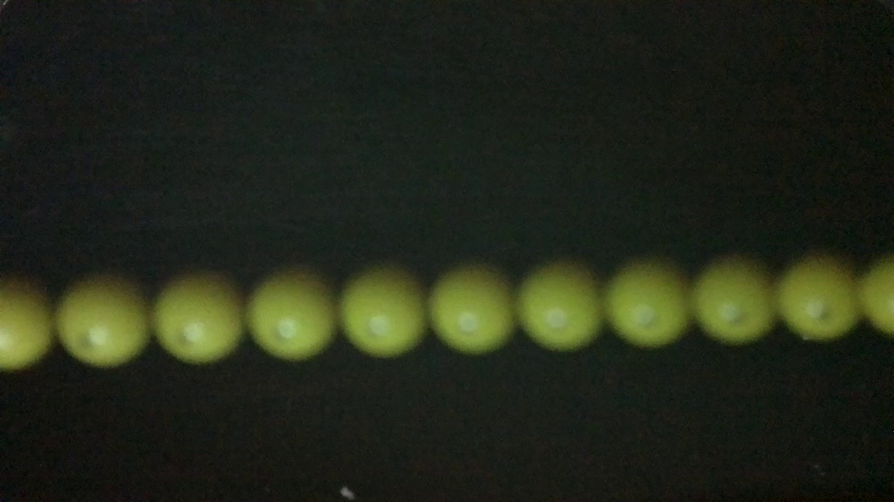

I enforced two different pellet speeds by making pellet collide with slightly slanted lath. You can see the distances between successive pellets being longer on left side before hitting the lath, than on the right side after. This multiple exposure capture was one captured by several shots with this command (pellet exposure on left side missing because offset 4010µs was slightly too big for this frame):

    $ sudo killall pigpiod; while true; do sudo ./audio_shots 20 9 4000 4010; done

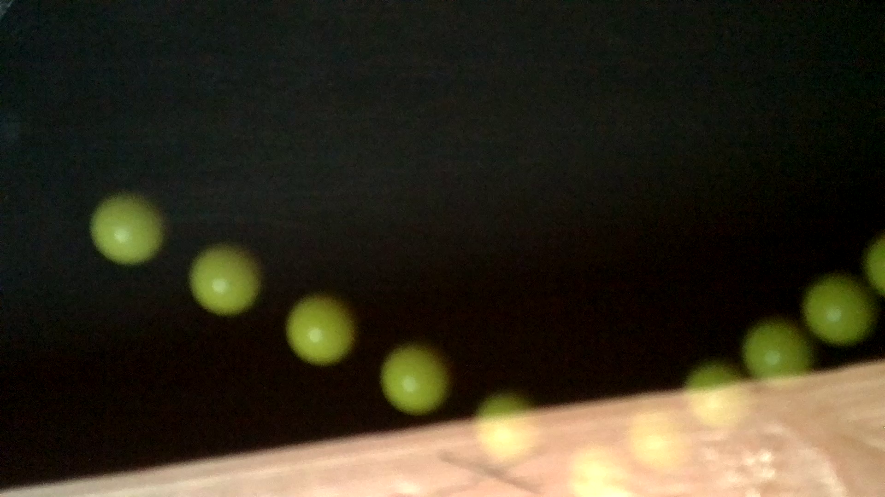

Now combining spin and two speeds investigation, I did only put one blue dot onto three pellets. I filled the magazine with 2 normal pellets, then the three pellets with a single blue dot, and finally a normal pellet. After starting raspivid_ges in one console, I started this command in another console:

    $ sudo killall pigpiod; while true; do sudo ./audio_shots 20 18 2500 2510; done

I reduced frequency to 2500Hz and doubled exposure to 18µs (OK for "slowly moving" 36m/s pellet). In shooting position, I removed magzine first and did two empty shots, in order to retrieve two candidates for empty.pnm. Then I inserted magazine, aimed at the cross on lath, fired and immediately looked onto the HDMI monitor 1.5m distant. Because raspivid_ges recording is done with 1fps, I was able to verify that the first shot was good. Then I did three more shots the same way with the pellets with 1 single blue dot. Before shooting I had moved the camera view up a little. The bright area above black cardboard does not hurt, and the lath part with cross where the pellet hits was moved out of camera view. This resulted in frame where all pellet exposures happened against black background. On side left of the cross the blue dot shows "slow" rotation as seen before. Interesting is the part after hitting the lath, a completely different rotation of the blue dot. For details see [corresponding fast camera panning animation](#user-content-camera_panning_2) in next section: 

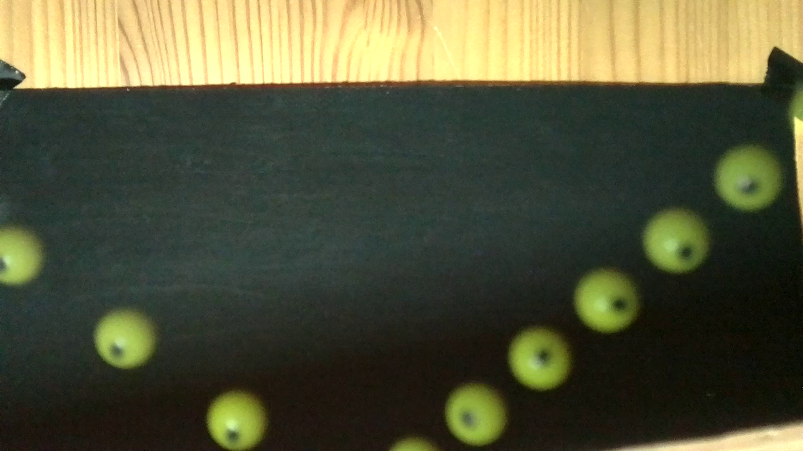

#### kFPS videos from kEPS multiple exposure frames

Now that we can create thousands of eps multiple exposure frames (kEPS), creating kFPS framerate videos from those frames seemed interesting. General purpose tools for that seem to be difficult to create at least (a frame with same view without the moving object would be helpful).

Fastest framerates for raspivid (640x480) videos are 90fps for v1 camera and 200fps for v2 camera. Fastest framerates for raspiraw videos are 665fps for v1 camera (640x64) and 1007fps for v2 camera (640x75). Creating kFPS framerate videos from kEPS multiple exposure frames is the only way for Raspberry v1 camera (not possible with v2 camera) to create this kind of super high framerate videos. And these vidoes can be of quite big frame size like the 2MP airsoft pistol multiple exposure frame.

[6mm.frame3946.jpg.sh](res/6mm.frame3946.jpg.sh) is a simple tool based on netpbm image tools and ffmpeg. It takes [6mm.frame3946.jpg](res/6mm.frame3946.jpg) image as input. The coordinates of the moving parts (left/top/width/height) used in the script were determined manually with gimp. The 3000fps animation was created with this command (scaled down from 1920 to 640 horizontally, animation framerate 2fps, 1500 times slower than real):

	./6mm.frame3946.jpg.sh 640 2

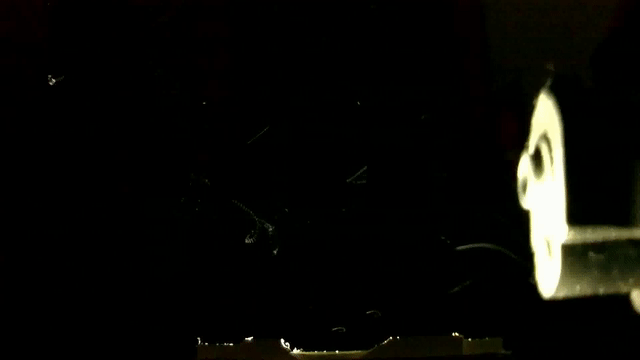

Second tool [pointed.pellet.frame0360_undistorted.jpg.sh](res/pointed.pellet.frame0360_undistorted.jpg.sh) uses same technique. It takes (594x438) [pointed.pellet.frame0360_undistorted.jpg](res/pointed.pellet.frame0360_undistorted.jpg) image as input. The coordinates of the moving parts were determined as before with gimp. The 9000fps animation was created with this command (no scaling horizontally, animation framerate 3fps, 3000 times slower than real):

	./pointed.pellet.frame0360_undistorted.jpg.sh 594 3

The video does not look as nice as the previous one. Reason is that the tool simply filled the area of the moving object with black, which is no problem for the first video with its nearly black background. It will be beneficial for new kEPS multiple exposure frames to move out the 5000lm leds from camera FOV in order to get a nearly black background again: 

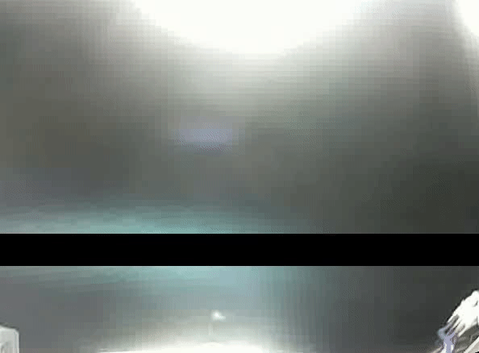

The sript is now modified so that it allows for optional 3rd and 4th argument. The numbers are the top/bottom lines to keep from the original image, the middle part will be filled black. This allows a slightly better animation although the original image background is too bright. Animation was created by this command:

	./pointed.pellet.frame0360_undistorted.jpg.sh 594 3 70 20

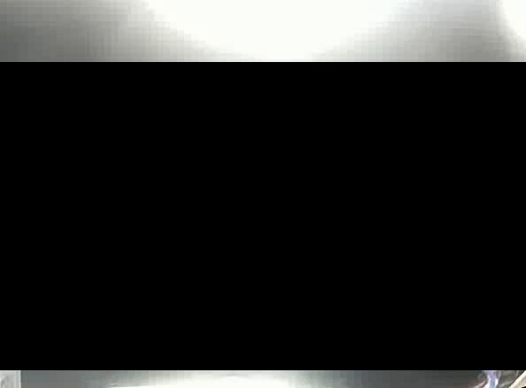

Tool [mak.640.5.sh](res/mak.640.5.sh) does not just fill the pellet exposures with black. Instead it takes two 2MP frames, one frame with pellet exposures [full.pnm](res/full.pnm) and another frame taken with same multiple exposures but without pellets captured [empty.pnm](res/empty.pnm):  
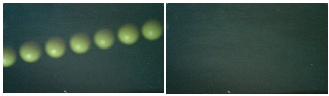  
For the different frames of the animation a single full height rectangle is taken from full.pnm and overlayed onto empty.pnm, and these frames are converted to video and animated .gif as before. The 1920x1080 frames get scaled down to width 640. 5000eps frame full.pnm gets 5000fps video that way; the animation plays at 5fps, 1000 times slower than real:  

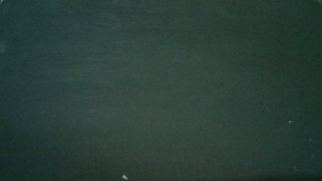

In [Sound trigger](#sound-trigger) section the pellet capture with blue dots on pellet north and south pole did show that pellet is spinning fast (5625rpm). Since an animation tells more than 1000 words, tool [mak.210.6.sh](res/mak.210.6.sh) creates a 6000fps animation for that 6000eps frame, this time with a very fast camera panning. The animation shows the spinnining with moving blue dot clearly; played at 6fps, 1000× slower than real:

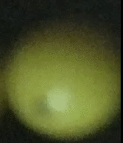

This is another very fast camera panning animation. It is done on frame with pellet exposures with 1 blue dot only, for the fully visible pellet exposures after hitting a lath [as described in Sound trigger section](#user-content-sound_spin_speed) show a completely different kind of spin:

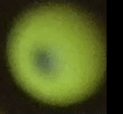

As can be seen in the animation, this time a rotation of the blue dot is complete in roughly 5 frames. With capturing frequency of 2500Hz that is 500rps or 30000rpm rotation speed. Pellet spin is a normal rotation, around line through center of the circle described by blue dots and pellet center.

## Hardware camera sync pulses

Tool [shots](tools/shots) is not synced with camera frames. shots tool might split its strobe pulses onto more than one frame because of the missing synchronization with camera.

In thread "Hardware camera sync pulses"  
[https://www.raspberrypi.org/forums/viewtopic.php?f=43&t=190314](https://www.raspberrypi.org/forums/viewtopic.php?f=43&t=190314)  
it was stated that as of the 22nd July 2017 firmware, there is support for repurposing the camera LED GPIO to change state on frame start and frame end interrupts.

As described in one of my postings in that thread I was able to make the hardware camera sync pulses appear on GPIO18.

New tool [gpio_alert.c](tools/gpio_alert.c) is camera synced multiple exposure sample. You compile it with 

	$ gcc -O6 -o gpio_alert gpio_alert.c -lpigpio -lrt -lpthread
	$

The tool uses GPIO13 for triggering two 9µs strobe pulses, 925000µs apart, synced with camera. Therefore both strobe pulses will always appear on a single frame captured with "-fps 1". I tested with pulses 950000µs apart, and there strobe pulses are split onto two frames in a strange way:  
[1st strange frame](https://raw.githubusercontent.com/Hermann-SW/Raspberry_v1_camera_global_external_shutter/master/res/two.HWsync.0a.jpg)  
[2nd strange frame](https://raw.githubusercontent.com/Hermann-SW/Raspberry_v1_camera_global_external_shutter/master/res/two.HWsync.0b.jpg)  

raspivid_ges starts pigpiod. For running gpio_alert, the daemon needs to be killed first after having started raspivid_ges:

	$ sudo killall pigpiod
	$ sudo ./gpio_alert 10
	$

The argument that has to be passed is the number of frames with camera synced double exposure.

This is one sample frame capture that way:
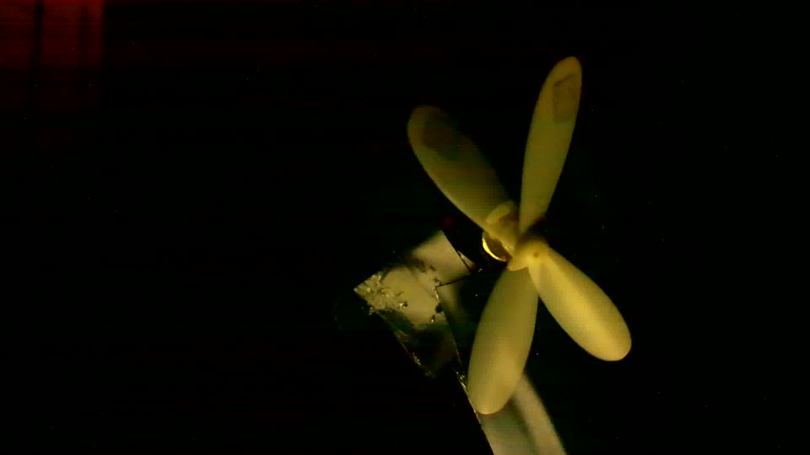

This is another sample frame capture that way, which looks different because of small changes in propeller speed:
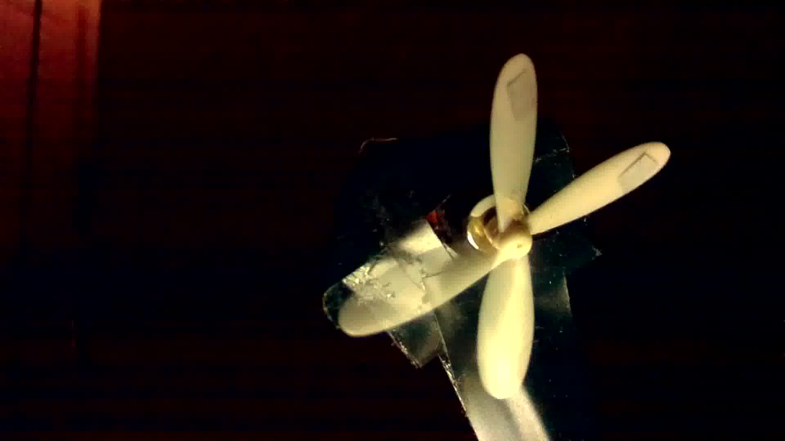

